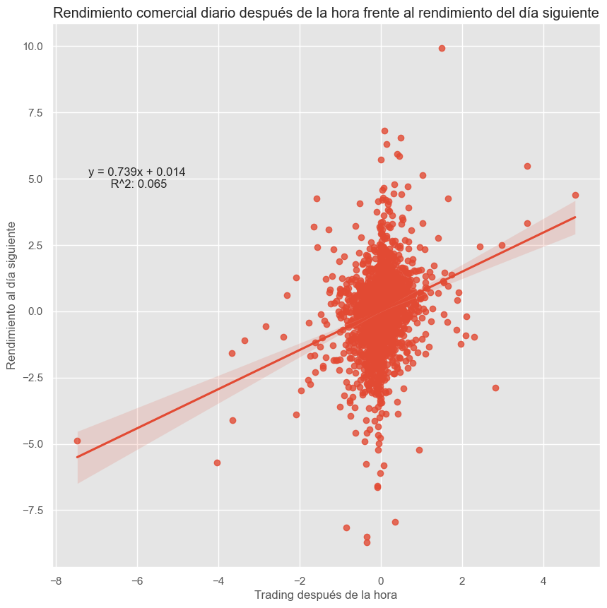

# Análisis Exploratorio de los datos:

El reporte se presenta en el notebook **analysis-sp500.ipynb.**

Los datos sin procesar se limpiarán en preparación para el análisis y la visualización de datos. Se eliminaron los datos que no eran necesarios para este análisis, se crearon nuevas columnas para el día de la semana, el mes y el año, y se crearon nuevas columnas para el cambio porcentual del precio intradiario, el precio de apertura/cierre y los cambios en el volumen diario.
Las columnas "Dividendo" y "Divisiones de acciones" se eliminarán porque no tienen datos significativos. El ticker del índice no produce un dividendo o división, ya que solo rastrea el índice.
Se consultó el dataframe resultante para encontrar las filas que contienen un cero para el valor 'Open'. Esto se señaló como una discrepancia en la sección de preparación de datos.
El dataframe se actualizó para utilizar el valor 'Close' del día anterior si el valor 'Open' es cero. Esto supone que no ha tenido lugar ninguna negociación de mercado ampliada. Según [Investopedia](https://www.investopedia.com/ask/answers/06/preaftermarket.asp#:~:text=The%20New%20York%20Stock%20Exchange%20introduced%20after%2Dmarket%20trading%20in,offered%20more%20hours%20of%20trading.),  después de que se iniciara la negociación en el mercado de la Bolsa de Nueva York en junio de 1991. Según el siguiente código, la última fila con un valor cero 'Open' fue el 19/4/1982.
Se crearon dos nuevas columnas para rastrear los cambios en el valor de cierre del día anterior y el valor de apertura del día siguiente. Una columna calcula los cambios en el precio y la otra calcula el cambio porcentual en el precio basado en el valor de cierre del día anterior. Estas nuevas columnas representan cualquier operación de horario extendido.

# Dashboard:

En el archivo **analysis-sp500.pbix** se pueden observar las graficas.

# KPIs:

Se deben sugerir 3 KPIs y deben aparecer en el **dashboard**.

# Análisis: 

El objetivo de este análisis es proporcionar un resumen de los datos históricos del S&P 500, destacando las principales tendencias y eventos clave. La primera subsección realiza análisis descriptivos (es decir, máx., media, mediana, etc.) y la segunda subsección proporciona una representación visual de los datos.

El rendimiento porcentual promedio diario es 1.627%.
Fuera de 5,786 días de negociación, solo 480 días (o 8.296%), han tenido cambios de precios diarios superiores al 1%, y fuera de eso 480 días, solo 68 días (o 1.175% del total de días de negociación) han tenido cambios de precio diarios superiores al 2.5%.
El porcentaje promedio del precio intradiario es 133.545%, que ocurrió el 2008-10-28
La pérdida de precio máxima diaria fue -872.310%, que ocurrió el 2008-10-15

### **Resumen anual**

Se creó un nuevo dataframe para almacenar los datos anuales resumidos del S&P 500. Estos datos incluyen los datos de cierre máximos y mínimos anuales, el valor de cierre anual medio y medio, los datos de apertura y cierre anuales junto con el cambio porcentual anual. Las fechas para los valores de cierre máximo y mínimo se agregaron al dataframe.

### **Resumen mensual**
Según la tabla anterior, parece que el mes de octubre tiene una variación diaria de precios significativamente mayor en comparación con los otros meses. Se consultó el dataframe limpio para encontrar las fechas de los cambios de precios máximos y mínimos en octubre.
El cambio de precio diario máximo de octubre de 10.789% ocurrió el 2008-10-28. El cambio de precio diario mínimo de octubre de -8.723% ocurrió el 2008-10-15.
Siete (7) de los diez (10) mayores movimientos de precios intradiarios ocurrieron durante la crisis financiera mundial de 2007-2009, otros dos (2) ocurrieron durante el [1987 Market Crash](https://www.federalreservehistory.org/essays/stock-market-crash-of-1987). Los grandes movimientos intradiarios no necesariamente indican una ganancia diaria positiva o negativa.

### **Resumen semanal**

Los movimientos semanales más grandes tienden a ocurrir a principios de año, esto podría deberse potencialmente al [January Effect](https://www.fool.com/investing/how-to-invest/stocks/january-effect/). Aunque la primera semana del año contiene la mayoría de los principales ganadores y perdedores semanales, esto no se correlaciona con las 10 ganancias/pérdidas diarias máximas/mínimas ni con los movimientos intradiarios.

### **Resumen diario**
Tenga en cuenta que la desviación estándar para el 'Monday' es significativamente más alta que la de los días restantes de la semana. Esto podría deberse potencialmente al gran valor mínimo de -20,46%. A partir del análisis del mes anterior, sabemos cuándo se produjo la caída de este precio. Este valor será eliminado para determinar su efecto.

Las ganancias y pérdidas diarias de precios ocurrieron durante la [2007-2009 Global Financial Crisis (también conocida como la Gran Recesión)](https://www.federalreservehistory.org/essays/great-recession-and-its-aftermath) con siete (7) de las mayores ganancias y cuatro (4) de las mayores pérdidas ocurriendo durante este tiempo. Siete (7) de las 10 mayores pérdidas diarias del S&P 500 ocurrieron el lunes y cinco (5) de las mayores pérdidas diarias ocurrieron en octubre.

Tenga en cuenta que es poco probable que ocurra otra caída diaria del precio del -20 % ya que [circuit breakers](https://www.investor.gov/introduction-investing/investing-basics/glossary/stock-market-circuit-breakers) fueron establecido después de la caída del mercado de 1987 para detener el comercio una vez que se alcanzan ciertos umbrales de precios intradía.

# Repositorio de GitHub:

El repositorio contiene un Readme con los graficos y el resumen del trabajo realizado.

# PLUS

# Análisis realizado en base a los dashboard 

# Análisis y funcionalidad de los KPIs sugeridos.

La Card 1 se utiliza con la medida rapida, Rentabilidad SP500 = DIVIDE(LASTNONBLANK('Asp500'[Close],1),FIRSTNONBLANK(Asp500[Close],1))-1

La Card 2 se utiliza con la medida rapida, Volumen Promedio = AVERAGE('Asp500'[Volume])

La Card 3 es un Slicer y se utiliza con el campo Date

# Cruce de datos con datasets complementarios.

Según la tabla anterior, parece que las grandes ganancias/pérdidas semanales en la primera semana del año pueden estar correlacionadas con el resultado anual de ese año. Para las 10 mayores ganancias semanales, cada año asociado generó un rendimiento anual positivo. Con la mitad de los años registrando rentabilidades superiores a la rentabilidad de la primera semana. Para las 10 principales pérdidas semanales, cada año asociado resultó en un rendimiento anual negativo. Con más de la mitad de los años publicando rendimientos inferiores al rendimiento de la primera semana.

El coeficiente de correlación de Pearson es 0.8375504954917371  con un valor P de P = 1.1601212809995247e-06 
Indica que la relación lineal es positiva y moderadamente fuerte. Además, tenga en cuenta que estas variables no son verdaderamente independientes ya que los datos semanales también forman parte del cálculo de datos anuales.

Todas las ganancias y pérdidas de los 10 principales después de la hora ocurrieron durante 2020, muy probablemente debido a la pandemia de COVID-19 y al apoyo fiscal y monetario resultante tanto en los Estados Unidos como a bordo. Según la correlación de Pearson que se muestra a continuación, las operaciones posteriores a la hora no parecen tener una correlación significativa con el movimiento de precios del día siguiente. Las ganancias/pérdidas después de la hora no tienen un impacto significativo en el movimiento de precios del siguiente día de negociación.

El coeficiente de correlación de Pearson es 0.254 con un valor P de P = 3.6537974588891216e-61 
Indica una pequeña relación lineal entre el comercio después de la hora y los cambios de precios diarios.

# Incorporar al análisis al menos una década de datos extra (datos previos al año 2000).
